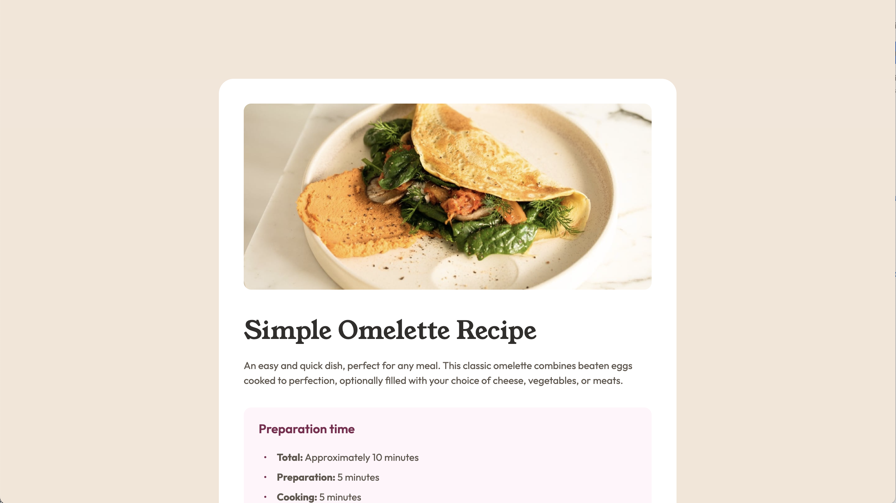

# Frontend Mentor - Recipe page solution

This is a solution to the [Recipe page challenge on Frontend Mentor](https://www.frontendmentor.io/challenges/recipe-page-KiTsR8QQKm). Frontend Mentor challenges help you improve your coding skills by building realistic projects.

## Table of contents

- [Overview](#overview)
  - [The challenge](#the-challenge)
  - [Screenshot](#screenshot)
  - [Links](#links)
- [My process](#my-process)
  - [Built with](#built-with)
  - [What I learned](#what-i-learned)
  - [Continued development](#continued-development)
  - [Useful resources](#useful-resources)
- [Author](#author)
- [Acknowledgments](#acknowledgments)

## Overview

### Screenshot

### Links

- Solution URL: [View Code](https://github.com/ldg/recipe-page-main)
- Live Site URL: [View the solution](https://ldg.github.io/recipe-page-main/)

## My process

### Built with

- Semantic HTML5 markup
- CSS custom properties
- Flexbox
- CSS Grid
- Mobile-first workflow
- [Sass](https://sass-lang.com/) - For styles

### What I learned

With this project I set up a series of mixins to manage the different text presets. In my previous challenge I tried setting up css custom properties to use for a font shorthand property. For reasons unknown I couldn't get that to work, so this project I turned to Sass's mixins and set up all the styels there and added it to my styles with an `@include mixin-name;`.

### Continued development

I'll continue to focus on the Sass workflow, as I work through Frontend Mentor's learning path challenges.

## Author

- Frontend Mentor - [@ldg](https://www.frontendmentor.io/profile/ldg)
